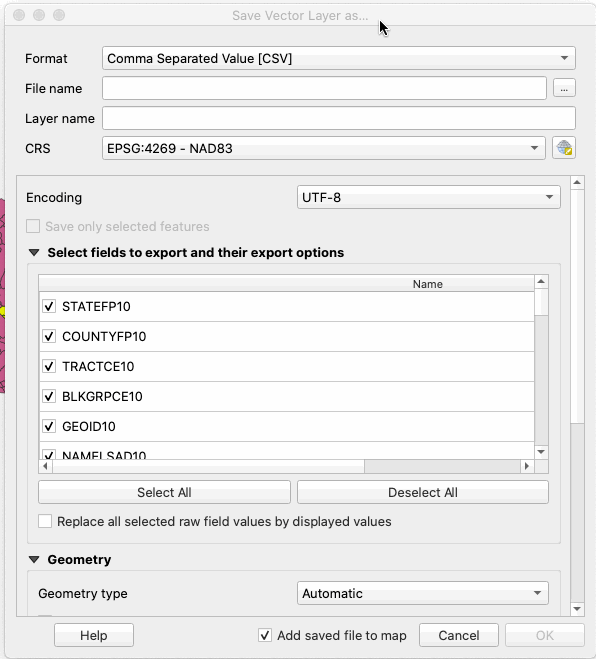

# Poultry farm analysis

Shared with Maya Miller, Cameron Oglesby and Robert Hellinga for the Duke Data Journalism Lab, Spring 2021.

**Note: The data and analysis contained in this repository is preliminary and for educational purposes only. All findings are subject to change upon additional reporting.**

## Data files

 - [ACS 5-year 2019 data on race, by NC block group](https://github.com/mtdukes/djl-poultry/blob/main/data/ACSDT5Y2019.B02001_2021-04-19T125758/ACSDT5Y2019.B02001_data_with_overlays_2021-04-19T125752.csv)
 - [2020 TIGER/Line NC block group shapefile](https://github.com/mtdukes/djl-poultry/tree/main/data/tl_2020_37_bg10)
 - [NC block group data with racial demographics and flag for overlapping 1-mile poultry farm buffer](https://github.com/mtdukes/djl-poultry/blob/main/data/nc_bg_poultry_1m.csv)

## Methodology

### Installing QGIS

QGIS is an open-source GIS platform useful for a range of common mapping tasks and analysis. [Download and install it for free.](https://qgis.org/en/site/)

### Loading poultry data

Once QGIS is installed, start the software and begin a new project with `Project > New`. Then click `Project > Save as...` to save and name your project file.

The poultry data you obtained is stored as a **shapefile**, and we'll load it into QGIS as a **vector layer**.

From the menu, click `Layer > Add Layer > Vector Layer` to bring up the **data source manager** window. Under `Source` you'll see a `Vector Dataset(s)` entry, and next to that, a file directory button: `...`. Click that button and identity your poultry shapefile, which should be titled `EWG_NC_Poultry_Locations.shp`. Click `Open` and, in the data source manager window, click `Add`.

There may be a warning dialogue referencing a "select transformation." The default here is fine, so just click `OK`.

You should now see a series of dots representing the poultry farm locations on your map.

### Loading block group geometry

Next, we'll need to retrieve data on the Census block groups in North Carolina. We'll get that data from the Census TIGER/Line Shapefiles collection, [downloadable here](https://www2.census.gov/geo/tiger/TIGER2020PL/STATE/37_NORTH_CAROLINA/37/tl_2020_37_bg10.zip).

Unzip the file and add it to your project using `Layer > Add Layer > Vector Layer`  and the **data source manager**.

You should now see the block group geometry overlayed on your map. You can change the order of your layers by clicking and dragging them in the `Layers` pane on the left side of the window.

By right-clicking on each layer, you can bring up a series of options. Right-click your block group shape layer and click `Open Attribute Table`. This is the data that currently corresponds to that block group geometry, and mostly describes the shape. But note one field in particular: `GEOID10`. This is a 12-digit code (sometimes called a FIPS code) that is unique to every block group in the country. It also describes the hierarchy of other geography in which the block group sits ("37" for example, is the state code for North Carolina).

It breaks down like this:

We'll use this ID to match with our demographic data.

### Retrieving and loading block group data

The most recent block group-level data on race is available from the Census Bureau's 2019 5-year American Community Survey (ACS considers Hispanic/non-Hispanic to be an ethnicity, and does not publish this data on a block group level).

We can use the [Census Bureau's data site](https://data.census.gov/cedsci/) to find what we need, but it can help to know [exactly what we're looking for](https://api.census.gov/data/2019/acs/acs5/variables.html). Specifically, that's **Table B02001** of the **ACS 2019 5-year data**, which describes the racial makeup of the block groups.

Enter "B02001" into the search field of the Census data site and select the table on race from the dropdown.

Your selection will default to the 1-year data, but use the dropdown in the top right to change that to the 5-year data, which has a smaller margin of error.

This is the data for the whole country, but we want it broken down by block groups in North Carolina. Click `Geos` and scroll down the `GEOGRAPHY` pane to select `Block Group`. In the `WITHIN (STATE)` pane, select `North Carolina`, and in the `WITHIN (COUNTY)` pane, select `All Block Groups within North Carolina`. You can then close the `Geos` pane. Go ahead and uncheck `Margin of Error`, since you won't likely be using that in your calculations.

Click the `DOWNLOAD TABLE` button to retrieve your data, which you'll download in a CSV.

The resulting zip file contains a few elements, including the data, a metadata file and accompanying documentation. We're going to import that data file into QGIS.

But instead of a vector layer, this time we're going click `Layer > Add Layer > Add Delimited Text Layer`. In the data source manager window, select your ACS data file. You might want to give it a short layer name for sanity's sake.

Most of your setting should be fine. You're importing a CSV with no geometry. But under R`ecord and Fields Options`, make sure `Number of header lines to discard` is set to 1 (the ACS data has a code header and a plain text header to describe the data, so we'll skip the code one). Click `Add`.

The map doesn't change, but if the import was successful, you'll see your new demographics layer along in the Layers pane.

### Joining the data

Before we join the demographics with the shapefiles, we'll need to clean up our matching ID field. Right click on the demographics layer you just imported and click `Open Attributes Table`. You'll find the id field contains that unique identifier, but there's some extra junk in there we need to clear out.

In your attributes table, click on `Open Field Calculator`, the icon that looks like a little abacus.

In `Output field name`, we'll name our new field `GEOID10` for simplicity. Set `Output field type` to `Text (string)`. And in the `Expression` field, type `right("id",12)`. This says we want our new field to be text equal to the 12 rightmost digits of the ID field in our existing data.

If there's no error in your formula, the Output preview at the bottom of the expression pane will show a valid ID. Click `OK`, let it calculate and you can find your brand new column all the way to the right at the end of your table.

Now we're ready to join. In your layer pane, right click your block group shapefile layer and click `Properties`. In the resulting menu, click `Joins` along the lefthand side.

Clicking on the green plus sign will start a new join. Your Join layer should be your ACS demographics data table. Set both your `Join field` (from your demographic data table) and your `Target field` (from your block group shapefile table) to `GEOID10`.  Click `OK` to close the join window, then `Apply` to initiate the join.

Now, opening up the attribution table to your block group shapefile contains the demographic data from ACS.

### Applying a buffer

To figure out which block groups are closest to poultry farms, we'll need to create some new geometry – a buffer around the points on the map showing poultry locations. QGIS makes this pretty easy.

Click `Vector > Geoprocessing Tools > Buffer` to open the buffer menu.

You `Input layer` should be the shapefile of poultry location. There's no one answer for distance, but in this case, we'll try creating a buffer with a 1-mile radius around each of the points. 

**IMPORTANT: We should acknowledge here that this method won't be precise for every resident in a  blockgroup, since some are larger than others. There are other ways to potentially measure distances, like calculating centroids for each block group, which might be worth exploring. Keep your methodology in mind as you write and report.**

Set your distance accordingly and click `Run`.

You'll see a new layer called "Buffered" in your layers menu.

### Identify overlapping block groups

With our buffered poultry farms in hand, we can see which block groups fall within the buffered zone to get some idea of the populations in close proximity to poultry farms.

First, let's select those block groups by clicking `Vector > Research Tools > Select by Location...`.

Set `Select features from` our block group shapefile that `intersect` with our buffered layer. Click `Run` and give it a minute.

All we have now is a selection of block groups that overlap with our buffered farms. Copy that selection through the menu by Clicking `Edit > Copy Features` (If this option is grayed out, check to make sure you've selected your block group shapefile layer in your Layer pane). Then paste those features as a new layer with `Edit > Paste Features As > New Vector Layer` .

The resulting dialogue gives us the option to save the layer as a shapefile or other sort of geometry format, but we don't actually need all of that. Set `Format` to `Comma Separated Value [CSV]` and set the file location.

We don't need all of the data here either. Under `Select fields to export and their export options`, click `Deselect All` and recheck the `GEOID10` field only. Then click `OK`. You should have a new later with a collection of IDs that overlap with your buffers.

### Joining overlapping block groups

Ideally, we want a spreadsheet of block groups and demographic information with an indicator/flag for whether the block group is "close" (by whatever definition we're using to define that word) to a poultry farm.

Open the attribute table of your newly created subset of block groups that overlap the poultry farm buffer and click the abacus icon to open the field calculator. Name your field `poultry_1m`, leave it as a whole number, but reduce the `Output Field Length` to `1`.

In your expression pane, just enter `1`. This will set every field to equal 1, which will serve as our indicator that the block group overlaps with a poultry farm buffer. Click `OK`.

Right click on your block group shapefile (which should already contain your demographic data from the join in a previous step) and click `Properties`. Click `Joins`.

This time, we're going to join our simplified subset of overlapping block groups with the block group shapefile. Click the plus icon, set the `Join layer` to your block group subset. Set the `Join field` and `Target field` to `GEOID10`. Then click `OK` and `Apply`.

You should now see your buffer overlap indicator column in the attributes table of your block group shapefile.

### Exporting your data

In your layers pane, right click your block group shape file and click `Export > Save Features As...`. If you're just planning to analyze the demographics, it's fine to just export the layer as a CSV. Just give it a filename. You can also specify which fields you do or don't want, if you're interested in simplifying the data a bit.

Hit OK to generate the CSV.